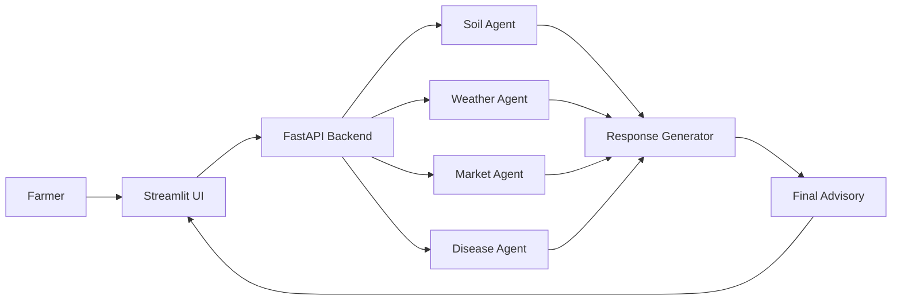

# 🏗 Architecture Document – KrishiSahayak AI Agent

## 📌 Overview

KrishiSahayak is an AI-powered smart farming system that helps farmers make better decisions using soil data, weather information, market trends, and plant disease detection.

The system is designed using a **modular agent-based architecture**, where each agent performs a specific task and communicates through a central backend.

---

## 🧩 System Architecture Diagram

---
## 🤖 Agent Roles

### 🌱 Soil Agent
- **Input:** Nitrogen (N), Phosphorus (P), Potassium (K)  
- **Function:**
  - Analyze soil health  
  - Suggest fertilizers  
- **Output:**  
  - Soil status and recommendations  

---

### 🌥 Weather Agent
- **Input:** City name  
- **Integration:** Weather API  
- **Function:**
  - Fetch real-time weather data  
  - Provide irrigation advice  
- **Output:**  
  - Temperature, humidity, rainfall, and suggestions  

---

### 📊 Market Agent
- **Input:** Crop type  
- **Function:**
  - Predict crop prices  
  - Identify market trends  
- **Output:**  
  - Expected price and selling advice  

---

### 🌿 Disease Agent
- **Input:** Leaf image  
- **Integration:** Image processing / ML model  
- **Function:**
  - Detect plant disease  
  - Suggest treatment  
- **Output:**  
  - Disease name and solution  

---

## 🔗 Communication Flow

1. Farmer interacts with Streamlit UI  
2. UI sends request to FastAPI backend  
3. Backend routes request to relevant agents  
4. Each agent processes the request independently  
5. Results are sent to Response Generator  
6. Response Generator combines outputs  
7. Final advisory is returned to UI  
8. Voice output is generated (optional)  

---

## 🔌 Tool Integrations

- **FastAPI** → API routing and backend logic  
- **Streamlit** → User interface  
- **Weather API** → Real-time weather data  
- **ML Model / Rules** → Disease detection  
- **gTTS** → Voice output  

---

## ⚠️ Error Handling Logic

### 1. Invalid Input Handling
- Detect incorrect or missing inputs  
- Show clear error messages to the user  

### 2. API Failure Handling
- If weather API fails:
  - Return fallback message  
  - Continue execution for other agents  

### 3. Image Upload Errors
- If no image is uploaded:
  - Prompt user to upload image  

### 4. Timeout Protection
- All API calls use timeout limits  
- Prevent system freezing  

### 5. Partial Failure Handling
- If one agent fails:
  - Other agents still provide results  
  - Partial advisory is shown  

---

## 🚀 System Characteristics

- **Modular** → Each agent works independently  
- **Scalable** → New agents can be added easily  
- **Robust** → Handles errors gracefully  
- **User-Friendly** → Simple UI with voice support  

---

## 📈 Impact

- Helps farmers make data-driven decisions  
- Reduces crop loss due to poor planning  
- Improves productivity and profit  
- Provides easy-to-understand recommendations  

---

## 🧩 Tech Stack

- **Frontend:** Streamlit  
- **Backend:** FastAPI  
- **APIs:** Weather API  
- **Machine Learning:** Image-based detection  
- **Voice:** gTTS  