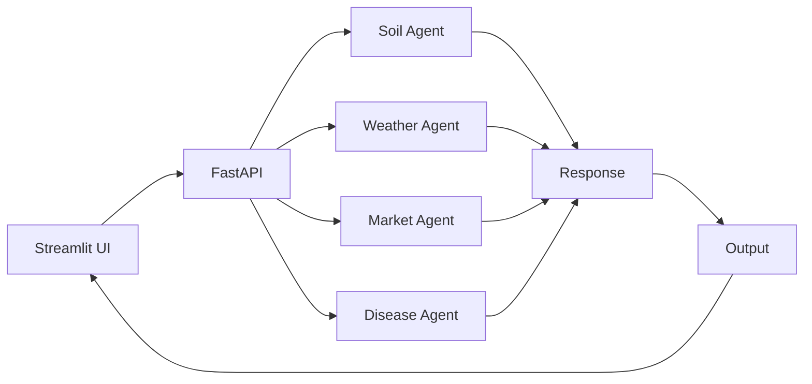

# 🌾 KrishiSahayak AI Agent

AI-powered smart farming assistant for Indian farmers.

---

## 🚀 Features

* 🌱 Soil Analysis (NPK-based)
* 🌦 Weather Advisory
* 💰 Market Price Prediction
* 🌿 Crop Disease Detection
* 🔊 Voice Output (Hindi + English)

---
## 🏗 System Architecture (Agent-Oriented)

## 🔄 Data Flow

User → Streamlit UI → FastAPI → Agents → Response Composer → UI + Voice Output

---

## ⚙️ Tech Stack

* Frontend: Streamlit
* Backend: FastAPI
* Voice: gTTS
* APIs: OpenWeather

---

## ▶️ Run Locally

### Install dependencies

pip install -r requirements.txt

### Run backend

uvicorn agri_agent:app --reload

### Run frontend

streamlit run app.py
