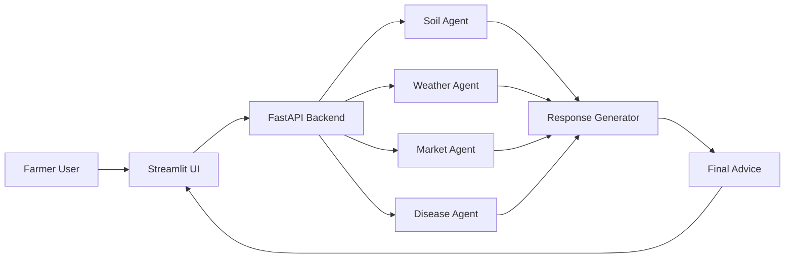

# 🌾 KrishiSahayak AI Agent

AI-powered smart farming assistant for Indian farmers.

---

## 🚀 Features

* 🌱 Soil Analysis (NPK-based)
* 🌦 Weather Advisory
* 💰 Market Price Prediction
* 🌿 Crop Disease Detection
* 🔊 Voice Output (Hindi + English)

---
## 🏗 System Architecture (Agent-Oriented)

---

## 🔍 What it shows (short explanation)

- **Farmer User** → interacts with the app  
- **Streamlit UI** → takes input (soil, city, image)  
- **FastAPI Backend** → processes requests  
- **Agents**:
  - Soil → fertilizer advice  
  - Weather → irrigation advice  
  - Market → price prediction  
  - Disease → plant treatment  
- **Response Generator** → combines everything  
- **Final Advice** → shown back in UI  

---

This is:
- ✅ Easy to understand  
- ✅ Clean for judges  
- ✅ 100% GitHub-safe  
- ✅ No rendering errors  

---

If you want next step:
👉 I can give you a **“pro-level architecture” that looks like startup diagrams (for winning submissions)**

## 🔄 Data Flow

User → Streamlit UI → FastAPI → Agents → Response Composer → UI + Voice Output

---

## ⚙️ Tech Stack

* Frontend: Streamlit
* Backend: FastAPI
* Voice: gTTS
* APIs: OpenWeather

---

## ▶️ Run Locally

### Install dependencies

pip install -r requirements.txt

### Run backend

uvicorn agri_agent:app --reload

### Run frontend

streamlit run app.py
